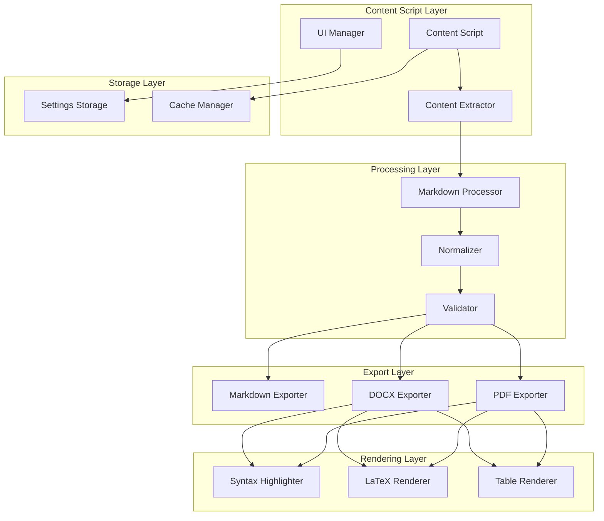
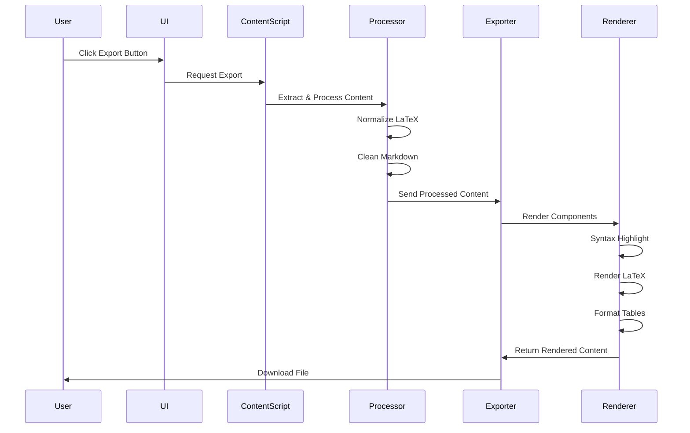

# Design Document: Multi-Format Export Enhancement

## Overview

Bu tasarım, AI Content Exporter Chrome Extension'ının export kalitesini ve format çeşitliliğini artırmayı amaçlamaktadır. Mevcut DOCX ve PDF export pipeline'ları iyileştirilecek, yeni Markdown export formatı eklenecek ve kullanıcılara farklı kalite/hız seçenekleri sunulacaktır.

### Goals

1. Yüksek kaliteli DOCX export (syntax highlighting, custom fonts, professional styling)
2. İki seviyeli PDF export (Hızlı vs Kaliteli)
3. Markdown export desteği (GitHub/Notion uyumlu)
4. Performans optimizasyonu (Web Workers, lazy loading)
5. Tutarlı cross-platform deneyim (ChatGPT, Claude, Gemini, DeepSeek)

### Non-Goals

- Real-time collaborative editing
- Cloud storage integration
- OCR veya image-to-text conversion
- Video/audio content export

## Architecture

### High-Level Architecture



### Component Interaction Flow



## Components and Interfaces

### 1. Content Extractor

**Responsibility**: AI platformlarından içerik çıkarma ve temizleme

**Interface**:
```javascript
class ContentExtractor {
  /**
   * Extract content from AI platform
   * @param {string} platform - Platform identifier (chatgpt, claude, gemini, deepseek)
   * @returns {Promise<ExtractedContent>}
   */
  async extractContent(platform);
  
  /**
   * Remove platform-specific UI elements
   * @param {HTMLElement} element - Content element
   * @returns {HTMLElement}
   */
  cleanPlatformElements(element);
  
  /**
   * Extract code blocks with language info
   * @param {HTMLElement} element - Content element
   * @returns {Array<CodeBlock>}
   */
  extractCodeBlocks(element);
  
  /**
   * Extract tables
   * @param {HTMLElement} element - Content element
   * @returns {Array<Table>}
   */
  extractTables(element);
}
```

**Data Structures**:
```javascript
interface ExtractedContent {
  rawHtml: string;
  markdown: string;
  codeBlocks: CodeBlock[];
  tables: Table[];
  latexFormulas: LatexFormula[];
  metadata: ContentMetadata;
}

interface CodeBlock {
  language: string;
  code: string;
  lineNumbers: boolean;
}

interface Table {
  headers: string[];
  rows: string[][];
  hasHeaderRow: boolean;
}

interface LatexFormula {
  type: 'inline' | 'block';
  formula: string;
  position: number;
}

interface ContentMetadata {
  platform: string;
  timestamp: Date;
  wordCount: number;
  hasCode: boolean;
  hasTables: boolean;
  hasLatex: boolean;
}
```

### 2. Markdown Processor

**Responsibility**: Markdown parsing, normalization ve validation

**Interface**:
```javascript
class MarkdownProcessor {
  /**
   * Parse markdown to AST
   * @param {string} markdown - Raw markdown
   * @returns {MarkdownAST}
   */
  parse(markdown);
  
  /**
   * Normalize LaTeX formulas
   * @param {string} markdown - Markdown with LaTeX
   * @returns {string}
   */
  normalizeLatex(markdown);
  
  /**
   * Convert HTML tables to markdown
   * @param {HTMLElement} table - HTML table element
   * @returns {string}
   */
  tableToMarkdown(table);
  
  /**
   * Validate markdown syntax
   * @param {string} markdown - Markdown content
   * @returns {ValidationResult}
   */
  validate(markdown);
}
```

### 3. Export Manager

**Responsibility**: Export işlemlerini koordine etme ve format seçimi

**Interface**:
```javascript
class ExportManager {
  /**
   * Export content in specified format
   * @param {ExtractedContent} content - Processed content
   * @param {ExportOptions} options - Export options
   * @returns {Promise<ExportResult>}
   */
  async export(content, options);
  
  /**
   * Get available export formats
   * @returns {Array<ExportFormat>}
   */
  getAvailableFormats();
  
  /**
   * Estimate export time
   * @param {ExtractedContent} content - Content to export
   * @param {string} format - Export format
   * @returns {number} Estimated time in milliseconds
   */
  estimateExportTime(content, format);
}
```

**Data Structures**:
```javascript
interface ExportOptions {
  format: 'markdown' | 'docx' | 'pdf-fast' | 'pdf-quality';
  settings: {
    preserveCodeBlocks: boolean;
    syntaxHighlighting: boolean;
    embedFonts: boolean;
    includeHeader: boolean;
    includeFooter: boolean;
    includeTOC: boolean;
    pageNumbers: boolean;
  };
  filename?: string;
}

interface ExportResult {
  success: boolean;
  filename: string;
  fileSize: number;
  duration: number;
  error?: string;
}
```

### 4. DOCX Exporter

**Responsibility**: Yüksek kaliteli DOCX dosyası oluşturma

**Interface**:
```javascript
class DocxExporter {
  /**
   * Convert markdown to DOCX
   * @param {ExtractedContent} content - Processed content
   * @param {ExportOptions} options - Export options
   * @returns {Promise<Blob>}
   */
  async convertToDocx(content, options);
  
  /**
   * Apply syntax highlighting to code blocks
   * @param {CodeBlock} codeBlock - Code block to highlight
   * @returns {DocxParagraph[]}
   */
  highlightCode(codeBlock);
  
  /**
   * Render LaTeX as Word equation
   * @param {LatexFormula} formula - LaTeX formula
   * @returns {DocxMathRun}
   */
  renderLatex(formula);
  
  /**
   * Create styled table
   * @param {Table} table - Table data
   * @returns {DocxTable}
   */
  createTable(table);
  
  /**
   * Add header and footer
   * @param {DocxDocument} doc - Document
   * @param {HeaderFooterOptions} options - Options
   */
  addHeaderFooter(doc, options);
}
```

### 5. PDF Exporter

**Responsibility**: İki seviyeli PDF export (Hızlı ve Kaliteli)

**Interface**:
```javascript
class PdfExporter {
  /**
   * Export as fast PDF (HTML→PDF)
   * @param {ExtractedContent} content - Processed content
   * @param {ExportOptions} options - Export options
   * @returns {Promise<Blob>}
   */
  async exportFastPdf(content, options);
  
  /**
   * Export as quality PDF (Advanced rendering)
   * @param {ExtractedContent} content - Processed content
   * @param {ExportOptions} options - Export options
   * @returns {Promise<Blob>}
   */
  async exportQualityPdf(content, options);
  
  /**
   * Render content to high-quality HTML
   * @param {ExtractedContent} content - Content
   * @returns {string} Styled HTML
   */
  renderToHtml(content);
  
  /**
   * Optimize page breaks
   * @param {HTMLElement} content - Content element
   */
  optimizePageBreaks(content);
}
```

### 6. Syntax Highlighter

**Responsibility**: Kod bloklarını syntax highlighting ile render etme

**Interface**:
```javascript
class SyntaxHighlighter {
  /**
   * Highlight code with specified language
   * @param {string} code - Source code
   * @param {string} language - Programming language
   * @returns {HighlightedCode}
   */
  highlight(code, language);
  
  /**
   * Get available languages
   * @returns {Array<string>}
   */
  getSupportedLanguages();
  
  /**
   * Detect language from code
   * @param {string} code - Source code
   * @returns {string} Detected language
   */
  detectLanguage(code);
}
```

**Data Structures**:
```javascript
interface HighlightedCode {
  html: string;
  tokens: Token[];
  language: string;
}

interface Token {
  type: string; // 'keyword', 'string', 'comment', etc.
  value: string;
  color: string;
}
```

### 7. LaTeX Renderer

**Responsibility**: LaTeX formüllerini render etme

**Interface**:
```javascript
class LatexRenderer {
  /**
   * Render LaTeX to HTML (for PDF)
   * @param {string} latex - LaTeX formula
   * @param {boolean} displayMode - Block or inline
   * @returns {string} Rendered HTML
   */
  renderToHtml(latex, displayMode);
  
  /**
   * Render LaTeX to DOCX equation
   * @param {string} latex - LaTeX formula
   * @returns {DocxMathRun}
   */
  renderToDocx(latex);
  
  /**
   * Validate LaTeX syntax
   * @param {string} latex - LaTeX formula
   * @returns {boolean}
   */
  validate(latex);
}
```

### 8. Settings Manager

**Responsibility**: Kullanıcı ayarlarını yönetme

**Interface**:
```javascript
class SettingsManager {
  /**
   * Load settings from Chrome storage
   * @returns {Promise<Settings>}
   */
  async loadSettings();
  
  /**
   * Save settings to Chrome storage
   * @param {Settings} settings - Settings to save
   * @returns {Promise<void>}
   */
  async saveSettings(settings);
  
  /**
   * Reset to default settings
   * @returns {Promise<Settings>}
   */
  async resetToDefaults();
  
  /**
   * Get default settings
   * @returns {Settings}
   */
  getDefaults();
}
```

**Data Structures**:
```javascript
interface Settings {
  export: {
    defaultFormat: string;
    preserveCodeBlocks: boolean;
    syntaxHighlighting: boolean;
    removeEmojis: boolean;
  };
  docx: {
    embedFonts: boolean;
    includeHeader: boolean;
    includeFooter: boolean;
    pageNumbers: boolean;
  };
  pdf: {
    defaultQuality: 'fast' | 'quality';
    dpi: number;
    embedFonts: boolean;
    includeTOC: boolean;
  };
  ui: {
    showFloatingButton: boolean;
    buttonPosition: 'top-right' | 'bottom-right';
  };
}
```

## Data Models

### Content Flow

```
Raw HTML (from AI platform)
    ↓
ExtractedContent (structured data)
    ↓
Markdown (normalized)
    ↓
MarkdownAST (parsed tree)
    ↓
[Branch based on format]
    ↓
Markdown File / DOCX Blob / PDF Blob
```

### Storage Schema

**Chrome Storage (sync)**:
```javascript
{
  "settings": {
    "version": "1.0.0",
    "export": { ... },
    "docx": { ... },
    "pdf": { ... },
    "ui": { ... }
  },
  "cache": {
    "lastExport": {
      "timestamp": "2024-01-01T00:00:00Z",
      "format": "docx",
      "success": true
    }
  }
}
```

## Correctness Properties

*A property is a characteristic or behavior that should hold true across all valid executions of a system-essentially, a formal statement about what the system should do. Properties serve as the bridge between human-readable specifications and machine-verifiable correctness guarantees.*


### Property 1: Markdown Export Preserves Code Block Format
*For any* markdown content containing code blocks with language specifiers, exporting to markdown format should preserve the ```language format exactly.
**Validates: Requirements 1.2**

### Property 2: LaTeX Formula Round-Trip Preservation
*For any* markdown content containing LaTeX formulas (both inline $...$ and block $...$), exporting to markdown should preserve the formulas in their original format without modification.
**Validates: Requirements 1.3**

### Property 3: GFM Table Format Compliance
*For any* HTML table, converting to markdown should produce output that conforms to GitHub Flavored Markdown table syntax with proper header separators and cell alignment.
**Validates: Requirements 1.4**

### Property 4: Platform Header Removal
*For any* content containing platform-specific headers (matching patterns like "ChatGPT said:", "Claude said:", etc.), the export process should remove these headers completely.
**Validates: Requirements 1.5**

### Property 5: DOCX LaTeX Conversion
*For any* LaTeX formula, DOCX export should convert it to Word's native equation format (MathML or OMML).
**Validates: Requirements 2.1**

### Property 6: DOCX Code Block Styling
*For any* code block in DOCX export, the output should contain monospace font styling and syntax highlighting with colored text runs.
**Validates: Requirements 2.2**

### Property 7: DOCX Table Structure Preservation
*For any* table, DOCX export should create a Word native table with the same number of rows and columns, including cell borders and background styling.
**Validates: Requirements 2.3**

### Property 8: DOCX Heading Style Mapping
*For any* markdown heading (h1-h6), DOCX export should map it to the corresponding Word heading style (Heading 1-6).
**Validates: Requirements 2.4**

### Property 9: Unicode Math Symbol Normalization
*For any* Unicode mathematical symbol (≤, ≥, ∈, etc.), DOCX export should normalize it to the equivalent LaTeX command (\leq, \geq, \in, etc.).
**Validates: Requirements 2.5**

### Property 10: Fast PDF Performance Constraint
*For any* content of moderate size (~50KB), fast PDF export should complete within 5 seconds.
**Validates: Requirements 3.2**

### Property 11: PDF LaTeX Rendering
*For any* LaTeX formula, PDF export should render it using KaTeX to produce visual mathematical notation in the output.
**Validates: Requirements 3.4**

### Property 12: PDF Code Block Highlighting
*For any* code block with a specified language, quality PDF export should render it with syntax highlighting (colored tokens).
**Validates: Requirements 3.6**

### Property 13: PDF Table Layout Optimization
*For any* table, quality PDF export should render it with column widths optimized based on content length.
**Validates: Requirements 3.8**

### Property 14: PDF Page Break Intelligence
*For any* content with headings, quality PDF export should ensure headings are not split across page boundaries.
**Validates: Requirements 3.9**

### Property 15: Settings Persistence Round-Trip
*For any* valid settings object, saving to Chrome storage and then loading should return an equivalent settings object.
**Validates: Requirements 4.1, 4.2**

### Property 16: Settings Reset to Defaults
*For any* modified settings, clicking "Reset to Defaults" should restore all settings to match the default settings object exactly.
**Validates: Requirements 4.3**

### Property 17: LaTeX Parse Error Graceful Degradation
*For any* invalid LaTeX formula that fails to parse, the export should render it as a code block and continue processing without throwing an error.
**Validates: Requirements 5.2**

### Property 18: Markdown Export Performance
*For any* content, markdown export should complete within 1 second.
**Validates: Requirements 6.1**

### Property 19: DOCX Export Performance
*For any* content of moderate size (~50KB), DOCX export should complete within 3 seconds.
**Validates: Requirements 6.2**

### Property 20: Fast PDF Export Performance
*For any* content, fast PDF export should complete within 5 seconds.
**Validates: Requirements 6.3**

### Property 21: Large Content Non-Blocking Export
*For any* content larger than 100KB, the export process should not block the main UI thread (should use Web Worker or async processing).
**Validates: Requirements 6.4**

### Property 22: Platform UI Element Exclusion
*For any* platform (ChatGPT, Claude, Gemini, DeepSeek), exported content should not contain platform-specific UI elements like buttons, avatars, or navigation elements.
**Validates: Requirements 7.5**

### Property 23: Syntax Highlighting Application
*For any* code block with a recognized language, rendering should apply syntax highlighting with multiple token types (keywords, strings, comments, etc.).
**Validates: Requirements 8.1**

### Property 24: KaTeX Rendering Application
*For any* LaTeX formula, rendering should use KaTeX to produce HTML markup containing mathematical notation.
**Validates: Requirements 8.2**

### Property 25: Table Column Width Optimization
*For any* table, rendering should calculate column widths based on content length to optimize readability.
**Validates: Requirements 8.3**

### Property 26: Image Handling Consistency
*For any* image in content, export should either embed it as base64 or preserve it as an external link (not lose the image).
**Validates: Requirements 8.4**

### Property 27: TOC Generation for Long Content
*For any* content with multiple headings (>5), export should generate a Table of Contents listing all headings with proper nesting.
**Validates: Requirements 8.5**

### Property 28: Filename Sanitization
*For any* input string used to generate a filename, the output filename should contain only valid filesystem characters (alphanumeric, dash, underscore, period).
**Validates: Requirements 9.4**

## Error Handling

### Error Categories

1. **Content Extraction Errors**
   - Platform not detected
   - No content found
   - Malformed HTML structure

2. **Processing Errors**
   - Invalid markdown syntax
   - LaTeX parse failures
   - Table structure errors

3. **Export Errors**
   - File generation failures
   - Browser download blocked
   - Insufficient memory

4. **Performance Errors**
   - Timeout exceeded
   - Content too large
   - Worker thread failure

### Error Handling Strategy

```javascript
class ErrorHandler {
  /**
   * Handle error with appropriate user feedback
   * @param {Error} error - Error object
   * @param {string} context - Context where error occurred
   * @returns {ErrorResponse}
   */
  handle(error, context) {
    const errorType = this.categorize(error);
    const userMessage = this.getUserMessage(errorType);
    const recovery = this.getRecoveryOptions(errorType);
    
    this.logError(error, context);
    this.showUserFeedback(userMessage, recovery);
    
    return {
      handled: true,
      userMessage,
      recovery,
      shouldRetry: this.isRetryable(errorType)
    };
  }
  
  /**
   * Categorize error type
   * @param {Error} error - Error object
   * @returns {string} Error category
   */
  categorize(error) {
    if (error.message.includes('platform')) return 'PLATFORM_ERROR';
    if (error.message.includes('LaTeX')) return 'LATEX_ERROR';
    if (error.message.includes('timeout')) return 'TIMEOUT_ERROR';
    if (error.message.includes('memory')) return 'MEMORY_ERROR';
    return 'UNKNOWN_ERROR';
  }
}
```

### Graceful Degradation

1. **LaTeX Rendering**: If KaTeX fails, fall back to raw LaTeX in code block
2. **Syntax Highlighting**: If highlighter fails, use plain monospace text
3. **Font Embedding**: If custom fonts fail, use system fonts
4. **Image Embedding**: If base64 fails, use external links

## Testing Strategy

### Unit Testing

**Framework**: Jest or Vitest

**Test Coverage Areas**:
1. Content extraction from each platform
2. Markdown parsing and normalization
3. LaTeX formula handling
4. Table conversion
5. Settings persistence
6. Error handling

**Example Unit Tests**:
```javascript
describe('ContentExtractor', () => {
  test('should extract code blocks with language info', () => {
    const html = '<pre><code class="language-javascript">const x = 1;</code></pre>';
    const result = extractor.extractCodeBlocks(html);
    expect(result[0].language).toBe('javascript');
    expect(result[0].code).toBe('const x = 1;');
  });
  
  test('should remove platform headers', () => {
    const content = 'ChatGPT said:\n\nHello world';
    const cleaned = extractor.cleanPlatformElements(content);
    expect(cleaned).toBe('Hello world');
  });
});
```

### Property-Based Testing

**Framework**: fast-check (JavaScript property testing library)

**Property Test Coverage**:
- All properties listed in Correctness Properties section
- Each property will be tested with 100+ random inputs
- Properties will be tagged with their requirement numbers

**Example Property Tests**:
```javascript
import fc from 'fast-check';

describe('Property Tests', () => {
  test('Property 2: LaTeX Formula Round-Trip Preservation', () => {
    fc.assert(
      fc.property(
        fc.string().filter(s => s.includes('$')),
        (markdown) => {
          const exported = markdownExporter.export(markdown);
          const latexBefore = extractLatex(markdown);
          const latexAfter = extractLatex(exported);
          return latexBefore.every((formula, i) => 
            formula === latexAfter[i]
          );
        }
      ),
      { numRuns: 100 }
    );
  });
  
  test('Property 18: Markdown Export Performance', () => {
    fc.assert(
      fc.property(
        fc.string({ minLength: 100, maxLength: 50000 }),
        async (content) => {
          const start = Date.now();
          await markdownExporter.export(content);
          const duration = Date.now() - start;
          return duration < 1000; // 1 second
        }
      ),
      { numRuns: 100 }
    );
  });
});
```

### Integration Testing

**Test Scenarios**:
1. End-to-end export flow for each format
2. Cross-platform content extraction
3. Settings persistence across browser restarts
4. Error recovery flows

**Example Integration Test**:
```javascript
describe('End-to-End Export', () => {
  test('should export ChatGPT conversation to DOCX', async () => {
    // Setup: Inject test content into page
    await page.goto('https://chat.openai.com/test');
    await page.evaluate(() => {
      document.body.innerHTML = testConversationHtml;
    });
    
    // Action: Click export button
    await page.click('[data-action="docx"]');
    
    // Assert: File downloaded
    const download = await page.waitForEvent('download');
    expect(download.suggestedFilename()).toMatch(/\.docx$/);
    
    // Assert: File is valid DOCX
    const buffer = await download.createReadStream();
    const isValid = await validateDocx(buffer);
    expect(isValid).toBe(true);
  });
});
```

### Performance Testing

**Metrics to Track**:
1. Export time by format and content size
2. Memory usage during export
3. Bundle size after build
4. Initial load time

**Performance Benchmarks**:
```javascript
describe('Performance Benchmarks', () => {
  test('markdown export should be fast', async () => {
    const content = generateContent(50000); // 50KB
    const start = performance.now();
    await markdownExporter.export(content);
    const duration = performance.now() - start;
    expect(duration).toBeLessThan(1000);
  });
  
  test('DOCX export should complete in reasonable time', async () => {
    const content = generateContent(50000);
    const start = performance.now();
    await docxExporter.export(content);
    const duration = performance.now() - start;
    expect(duration).toBeLessThan(3000);
  });
});
```

### Manual Testing Checklist

- [ ] Test on ChatGPT with various content types
- [ ] Test on Claude with various content types
- [ ] Test on Gemini with various content types
- [ ] Test on DeepSeek with various content types
- [ ] Verify DOCX opens correctly in Microsoft Word
- [ ] Verify DOCX opens correctly in Google Docs
- [ ] Verify DOCX opens correctly in LibreOffice
- [ ] Verify PDF renders correctly in Adobe Reader
- [ ] Verify PDF renders correctly in Chrome PDF viewer
- [ ] Verify Markdown renders correctly on GitHub
- [ ] Test with very long content (>1MB)
- [ ] Test with content containing special characters
- [ ] Test with content in different languages (Turkish, Chinese, Arabic)
- [ ] Test error scenarios (no content, invalid LaTeX, etc.)

## Implementation Notes

### Library Selection Rationale

**DOCX Generation**:
- **Option 1**: Continue with `@m2d/core` + enhancements
  - ✅ Already integrated
  - ✅ Good LaTeX support
  - ⚠️ Limited styling control
- **Option 2**: Switch to `docx` library
  - ✅ Full control over styling
  - ✅ Better table support
  - ❌ More complex API
  - ❌ Migration effort

**Recommendation**: Enhance `@m2d/core` with custom renderers for better styling

**PDF Generation**:
- **Option 1**: Continue with `html2pdf.js`
  - ✅ Already integrated
  - ✅ Simple API
  - ⚠️ Limited control
- **Option 2**: Switch to `pdfmake`
  - ✅ Better control
  - ✅ Better table support
  - ✅ Custom fonts
  - ❌ More complex
- **Option 3**: Use `jsPDF` + `jspdf-autotable`
  - ✅ Good table support
  - ✅ Mature library
  - ⚠️ Manual layout

**Recommendation**: Implement dual approach:
- Fast PDF: Keep `html2pdf.js`
- Quality PDF: Use `pdfmake` for better control

**Syntax Highlighting**:
- **Option 1**: `highlight.js`
  - ✅ Lightweight
  - ✅ Many languages
  - ✅ Easy integration
- **Option 2**: `prism.js`
  - ✅ More languages
  - ✅ Plugins
  - ⚠️ Larger bundle

**Recommendation**: Use `highlight.js` with selective language loading

**Markdown Parsing**:
- **Option 1**: Continue with `remark`
  - ✅ Already integrated
  - ✅ Plugin ecosystem
- **Option 2**: Switch to `markdown-it`
  - ✅ Faster
  - ✅ More flexible
  - ❌ Migration effort

**Recommendation**: Continue with `remark` ecosystem

### Performance Optimization Strategies

1. **Lazy Loading**:
   - Load PDF converter only when needed
   - Load syntax highlighter on first use
   - Load language definitions on demand

2. **Web Workers**:
   - Move heavy processing to workers
   - Keep UI responsive during export
   - Use transferable objects for large data

3. **Caching**:
   - Cache parsed markdown AST
   - Cache highlighted code blocks
   - Cache rendered LaTeX

4. **Bundle Optimization**:
   - Tree-shaking unused code
   - Code splitting by format
   - Minification and compression

### Security Considerations

1. **Content Sanitization**:
   - Sanitize HTML before processing
   - Validate LaTeX input
   - Escape special characters in filenames

2. **Resource Limits**:
   - Limit maximum content size
   - Timeout long-running operations
   - Prevent memory exhaustion

3. **User Privacy**:
   - No data sent to external servers
   - All processing done locally
   - Settings stored locally only

## Deployment Strategy

### Build Process

```bash
# Install dependencies
npm install

# Build all bundles
npm run build

# Run tests
npm test

# Package extension
npm run package
```

### Webpack Configuration Updates

```javascript
// Add new entry points for enhanced exporters
module.exports = [
  // ... existing configs
  {
    entry: './src/markdown-exporter.js',
    output: {
      filename: 'markdown-exporter-bundled.js',
      path: path.resolve(__dirname, 'lib'),
    }
  },
  {
    entry: './src/pdf-quality-exporter.js',
    output: {
      filename: 'pdf-quality-exporter-bundled.js',
      path: path.resolve(__dirname, 'lib'),
    }
  }
];
```

### Version Migration

**Current Version**: 1.1.0
**Target Version**: 2.0.0

**Migration Steps**:
1. Add new export formats without breaking existing functionality
2. Migrate settings schema with backward compatibility
3. Update manifest.json with new permissions if needed
4. Test on all supported platforms
5. Deploy to Chrome Web Store

### Rollback Plan

If issues are discovered after deployment:
1. Revert to previous version in Chrome Web Store
2. Investigate and fix issues
3. Re-deploy with fixes

## Future Enhancements

### Phase 2 Features

1. **Batch Export**: Export multiple conversations at once
2. **Custom Templates**: User-defined export templates
3. **Export History**: Track and manage previous exports
4. **Cloud Sync**: Optional cloud backup of exports

### Phase 3 Features

1. **Collaborative Editing**: Share and edit exports
2. **Advanced Formatting**: More styling options
3. **Plugin System**: Allow third-party extensions
4. **API Access**: Programmatic export access

## Appendix

### Glossary of Technical Terms

- **AST**: Abstract Syntax Tree - tree representation of code structure
- **GFM**: GitHub Flavored Markdown - GitHub's markdown variant
- **KaTeX**: Fast math typesetting library
- **OMML**: Office Math Markup Language - Word's equation format
- **Tree-shaking**: Removing unused code from bundles
- **Web Worker**: Background thread for heavy computation

### References

- [Office Open XML Specification](http://www.ecma-international.org/publications/standards/Ecma-376.htm)
- [PDF Specification](https://www.adobe.com/devnet/pdf/pdf_reference.html)
- [GitHub Flavored Markdown Spec](https://github.github.com/gfm/)
- [KaTeX Documentation](https://katex.org/docs/api.html)
- [highlight.js Documentation](https://highlightjs.org/)
